# Design Document: Government Services Chatbot

## Overview

The Government Services Chatbot is a multi-platform conversational AI system that helps citizens navigate government services efficiently. The system provides personalized guidance through WhatsApp and Telegram, supporting multiple languages and input methods while maintaining precise, actionable responses.

### Key Design Principles

- **Platform Agnostic**: Unified core logic with platform-specific adapters
- **Language Flexible**: Multi-language support with consistent functionality
- **Data-Driven**: Recommendations based on Master File and Location File data
- **User-Centric**: Personalized responses based on user profiles and location
- **Resilient**: Graceful error handling and fallback mechanisms

## Architecture

### High-Level Architecture

```mermaid
flowchart LR
    %% Input Nodes
    WA[📱 WhatsApp<br/>User Message] --> RECEIVE[📥 Receive<br/>Message]
    TG[📱 Telegram<br/>User Message] --> RECEIVE
    
    %% Processing Flow
    RECEIVE --> CHECK{👤 User<br/>Exists?}
    CHECK -->|No| ONBOARD[📝 Onboarding<br/>Name, Address, City, State]
    CHECK -->|Yes| PROCESS[🔍 Process<br/>Query]
    ONBOARD --> SAVE_USER[(💾 Save User<br/>Profile)]
    SAVE_USER --> PROCESS
    
    %% Query Processing
    PROCESS --> SEARCH_VECTOR[🔎 Search Vector<br/>Database]
    SEARCH_VECTOR --> FOUND{📊 Results<br/>Found?}
    
    %% Data Sources
    FOUND -->|Yes| FORMAT[📝 Format<br/>Response]
    FOUND -->|No/Low Quality| GMAPS[🗺️ Google Maps<br/>Search]
    GMAPS --> UPDATE_DB[📊 Update Vector<br/>Database]
    UPDATE_DB --> FORMAT
    
    %% Fallback
    GMAPS -->|No Results| AI[🧠 AI Fallback<br/>Gemini/ChatGPT]
    AI --> FORMAT
    
    %% Response
    FORMAT --> SEND_MAIN[📤 Send Main<br/>Recommendation]
    SEND_MAIN --> SEND_LOC[📍 Send Location<br/>Messages]
    SEND_LOC --> END[✅ Complete]
    
    %% Data Initialization (One-time)
    MASTER[📋 Master File] -.->|Initial Load| VECTOR_DB[(📊 Vector Database)]
    LOCATION[📍 Location File] -.->|Initial Load| VECTOR_DB
    
    %% Styling for n8n look
    classDef inputNode fill:#e3f2fd,stroke:#1976d2,stroke-width:2px
    classDef processNode fill:#f3e5f5,stroke:#7b1fa2,stroke-width:2px
    classDef decisionNode fill:#fff3e0,stroke:#f57c00,stroke-width:2px
    classDef dataNode fill:#e8f5e8,stroke:#388e3c,stroke-width:2px
    classDef outputNode fill:#fce4ec,stroke:#c2185b,stroke-width:2px
    classDef initData fill:#f1f8e9,stroke:#689f38,stroke-width:1px,stroke-dasharray: 5 5
    
    class WA,TG,RECEIVE inputNode
    class ONBOARD,PROCESS,SEARCH_VECTOR,GMAPS,UPDATE_DB,AI,FORMAT,SEND_MAIN,SEND_LOC processNode
    class CHECK,FOUND decisionNode
    class SAVE_USER,VECTOR_DB dataNode
    class END outputNode
    class MASTER,LOCATION initData
```



### Component Architecture

The system follows a layered architecture with clear separation of concerns:

1. **Platform Layer**: Handles platform-specific communication protocols
2. **Core Services Layer**: Contains business logic and processing capabilities
3. **Data Layer**: Manages persistent storage and external data sources

## Components and Interfaces

### Platform Adapters

#### WhatsApp Adapter
```typescript
interface WhatsAppAdapter {
  receiveMessage(webhook: WhatsAppWebhook): Promise<void>
  sendTextMessage(phoneNumber: string, message: string): Promise<void>
  sendLocationMessage(phoneNumber: string, location: LocationInfo): Promise<void>
  sendQuickReplyMessage(phoneNumber: string, message: string, options: QuickReply[]): Promise<void>
  processVoiceMessage(audioUrl: string): Promise<string>
}
```

#### Telegram Adapter
```typescript
interface TelegramAdapter {
  receiveUpdate(update: TelegramUpdate): Promise<void>
  sendTextMessage(chatId: string, message: string): Promise<void>
  sendLocationMessage(chatId: string, location: LocationInfo): Promise<void>
  sendInlineKeyboard(chatId: string, message: string, keyboard: InlineKeyboard): Promise<void>
  processVoiceMessage(fileId: string): Promise<string>
}
```

### Core Services

#### Conversation Manager
```typescript
interface ConversationManager {
  processMessage(userId: string, platform: Platform, message: IncomingMessage): Promise<OutgoingMessage[]>
  maintainContext(userId: string, context: ConversationContext): Promise<void>
  getConversationState(userId: string): Promise<ConversationState>
}

enum ConversationState {
  NEW_USER,
  ONBOARDING_NAME,
  ONBOARDING_CITY,
  ONBOARDING_STATE,
  ONBOARDING_LANGUAGE,
  ACTIVE,
  AWAITING_CLARIFICATION
}
```

#### NLP Service
```typescript
interface NLPService {
  detectLanguage(text: string): Promise<Language>
  extractIntent(text: string, language: Language): Promise<ServiceIntent>
  extractEntities(text: string, language: Language): Promise<Entity[]>
  translateText(text: string, targetLanguage: Language): Promise<string>
}

interface ServiceIntent {
  service: GovernmentService
  confidence: number
  entities: Entity[]
}
```

#### Recommendation Service
```typescript
interface RecommendationService {
  generateRecommendations(query: ServiceQuery, userProfile: UserProfile): Promise<ServiceRecommendation[]>
  findNearestOffices(serviceType: string, userAddress: string, city: string, state: string): Promise<OfficeLocation[]>
  searchWithGoogleMaps(serviceType: string, userProfile: UserProfile): Promise<OfficeLocation[]>
  formatRecommendation(recommendation: ServiceRecommendation, language: Language): Promise<FormattedResponse>
  searchVectorDatabase(query: string, threshold: number): Promise<VectorSearchResult[]>
  fallbackToGeneralAI(query: string, language: Language): Promise<GeneralAIResponse>
  calculateDistanceAndTime(userAddress: string, officeAddress: string): Promise<DistanceInfo>
}

interface VectorSearchResult {
  content: string
  similarity: number
  metadata: Record<string, any>
}

interface GeneralAIResponse {
  response: string
  confidence: number
  source: 'gemini' | 'chatgpt'
  disclaimer: string
}

interface DistanceInfo {
  distance: string
  travelTime: string
  mode: 'driving' | 'walking' | 'transit'
}
```

#### User Profile Service
```typescript
interface UserProfileService {
  createProfile(userId: string, platform: Platform): Promise<UserProfile>
  updateProfile(userId: string, updates: Partial<UserProfile>): Promise<UserProfile>
  getProfile(userId: string): Promise<UserProfile | null>
  isOnboardingComplete(profile: UserProfile): boolean
}
```

#### Voice Service
```typescript
interface VoiceService {
  transcribeAudio(audioUrl: string, language: Language): Promise<TranscriptionResult>
  detectLanguageFromAudio(audioUrl: string): Promise<Language>
}

interface TranscriptionResult {
  text: string
  confidence: number
  language: Language
}
```

#### Google Maps Scraper Service
```typescript
interface GoogleMapsScraperService {
  searchGovernmentOffices(serviceType: string, userAddress: string, city: string, state: string): Promise<GoogleMapsResult[]>
  extractOfficeDetails(placeId: string): Promise<OfficeDetails>
  validateAndCleanData(rawData: GoogleMapsResult[]): Promise<OfficeLocation[]>
  cacheResults(searchKey: string, results: GoogleMapsResult[], ttl: number): Promise<void>
  getCachedResults(searchKey: string): Promise<GoogleMapsResult[] | null>
}

interface GoogleMapsResult {
  placeId: string
  name: string
  address: string
  phoneNumber?: string
  rating?: number
  openingHours?: string[]
  website?: string
  coordinates: Coordinates
  distance?: number
  travelTime?: string
}

interface OfficeDetails {
  name: string
  address: string
  phoneNumber?: string
  timings: OfficeTimings
  coordinates: Coordinates
  additionalInfo?: string[]
  userReviews?: string[]
}

interface Coordinates {
  latitude: number
  longitude: number
}
```

## Data Models

### User Profile
```typescript
interface UserProfile {
  userId: string
  platform: Platform
  name?: string
  address?: string
  city?: string
  state?: string
  language: Language
  createdAt: Date
  updatedAt: Date
  onboardingComplete: boolean
}

enum Platform {
  WHATSAPP = 'whatsapp',
  TELEGRAM = 'telegram'
}

enum Language {
  HINDI = 'hi',
  ENGLISH = 'en'
}
```

### Service Query
```typescript
interface ServiceQuery {
  userId: string
  text: string
  language: Language
  intent: ServiceIntent
  entities: Entity[]
  timestamp: Date
}

interface Entity {
  type: EntityType
  value: string
  confidence: number
}

enum EntityType {
  DOCUMENT_TYPE,
  SERVICE_TYPE,
  LOCATION,
  DATE,
  PERSON_NAME
}
```

### Service Recommendation
```typescript
interface ServiceRecommendation {
  serviceType: string
  offices: OfficeLocation[]
  requiredDocuments: string[]
  estimatedTime: string
  additionalNotes: string[]
}

interface OfficeLocation {
  name: string
  address: string
  city: string
  state: string
  phoneNumber?: string
  timings: OfficeTimings
  coordinates?: Coordinates
}

interface OfficeTimings {
  weekdays: string
  saturday?: string
  sunday?: string
  holidays: string
}
```

### Master File Schema
```typescript
interface MasterFileEntry {
  serviceId: string
  serviceName: string
  serviceNameHindi: string
  officeType: string
  requiredDocuments: string[]
  estimatedProcessingTime: string
  fees?: string
  onlineAvailable: boolean
}
```

### Location File Schema
```typescript
interface LocationFileEntry {
  officeId: string
  officeName: string
  officeType: string
  address: string
  city: string
  state: string
  pincode: string
  phoneNumber?: string
  email?: string
  timings: OfficeTimings
  coordinates?: Coordinates
  servicesOffered: string[]
}
```

### Message Models
```typescript
interface IncomingMessage {
  userId: string
  platform: Platform
  type: MessageType
  content: string
  timestamp: Date
  metadata?: MessageMetadata
}

interface OutgoingMessage {
  userId: string
  platform: Platform
  type: MessageType
  content: string
  formatting?: MessageFormatting
  quickReplies?: QuickReply[]
}

enum MessageType {
  TEXT,
  VOICE,
  LOCATION,
  QUICK_REPLY
}
```

## API Specifications

### REST API Endpoints

#### Webhook Endpoints
```typescript
// WhatsApp webhook
POST /webhooks/whatsapp
Content-Type: application/json
Body: WhatsAppWebhookPayload

// Telegram webhook  
POST /webhooks/telegram
Content-Type: application/json
Body: TelegramUpdatePayload
```

#### User Management
```typescript
// Get user profile
GET /users/{userId}
Response: UserProfile

// Update user profile
PUT /users/{userId}
Body: Partial<UserProfile>
Response: UserProfile

// Delete user profile
DELETE /users/{userId}
Response: 204 No Content
```

#### Service Recommendations
```typescript
// Get service recommendations
POST /recommendations
Body: {
  userId: string
  query: string
  language: Language
}
Response: ServiceRecommendation[]
```

### External API Integration

#### WhatsApp Business API
```typescript
interface WhatsAppAPI {
  sendMessage(phoneNumber: string, message: WhatsAppMessage): Promise<void>
  uploadMedia(file: Buffer, type: string): Promise<string>
  getMediaUrl(mediaId: string): Promise<string>
}
```

#### Telegram Bot API
```typescript
interface TelegramAPI {
  sendMessage(chatId: string, text: string, options?: SendMessageOptions): Promise<void>
  getFile(fileId: string): Promise<TelegramFile>
  downloadFile(filePath: string): Promise<Buffer>
}
```

## User Interface Flows

### Onboarding Flow


### Service Query Flow


### Service Query Flow with Google Maps Integration


### Voice Input Flow


## Integration Patterns

### Platform Integration Pattern
```typescript
abstract class PlatformAdapter {
  abstract receiveMessage(payload: any): Promise<void>
  abstract sendMessage(userId: string, message: OutgoingMessage): Promise<void>
  
  protected async processMessage(userId: string, message: IncomingMessage): Promise<void> {
    const responses = await this.conversationManager.processMessage(userId, this.platform, message)
    for (const response of responses) {
      await this.sendMessage(userId, response)
    }
  }
}
```

### Data Source Integration Pattern
```typescript
interface DataSourceAdapter<T> {
  connect(): Promise<void>
  query(criteria: QueryCriteria): Promise<T[]>
  disconnect(): Promise<void>
}

class VectorDatabaseAdapter {
  async storeFileData(masterData: MasterFileEntry[], locationData: LocationFileEntry[]): Promise<void> {
    const documents: VectorDocument[] = [
      ...masterData.map(entry => this.convertMasterEntryToVector(entry)),
      ...locationData.map(entry => this.convertLocationEntryToVector(entry))
    ]
    await this.vectorDB.storeDocuments(documents)
  }
  
  async searchRelevantInfo(query: string, threshold: number = 0.7): Promise<VectorSearchResult[]> {
    return await this.vectorDB.searchSimilar(query, 10, threshold)
  }
}
```

### Vector-Only Response Strategy Pattern
```typescript
class VectorOnlyResponseStrategy {
  async generateResponse(query: ServiceQuery, userProfile: UserProfile): Promise<ServiceRecommendation[]> {
    // Step 1: Search vector database for relevant information
    const vectorResults = await this.vectorDB.searchRelevantInfo(query.text, 0.7)
    
    if (vectorResults.length > 0 && vectorResults[0].similarity > 0.8) {
      // High confidence match in vector database
      return this.generateFromVectorResults(vectorResults, userProfile)
    }
    
    // Step 2: Try broader vector search with lower threshold
    const broaderResults = await this.vectorDB.searchRelevantInfo(query.text, 0.5)
    
    if (broaderResults.length > 0) {
      return this.generateFromVectorResults(broaderResults, userProfile)
    }
    
    // Step 3: Fallback to general AI models
    return this.generateFromGeneralAI(query, userProfile)
  }
  
  private async generateFromGeneralAI(query: ServiceQuery, userProfile: UserProfile): Promise<ServiceRecommendation[]> {
    const prompt = this.buildContextualPrompt(query, userProfile)
    
    // Try multiple AI services and select best response
    const [geminiResponse, chatgptResponse] = await Promise.allSettled([
      this.generalAI.queryGemini(prompt, query.language),
      this.generalAI.queryChatGPT(prompt, query.language)
    ])
    
    const bestResponse = await this.selectBestAIResponse([geminiResponse, chatgptResponse])
    
    return this.convertAIResponseToRecommendation(bestResponse, userProfile)
  }
}
```

### Error Handling Pattern
```typescript
class ErrorHandler {
  static async handleError(error: Error, context: ErrorContext): Promise<OutgoingMessage> {
    if (error instanceof ValidationError) {
      return this.createValidationErrorResponse(error, context)
    } else if (error instanceof DataSourceError) {
      return this.createDataSourceErrorResponse(error, context)
    } else {
      return this.createGenericErrorResponse(error, context)
    }
  }
}
```

## Correctness Properties

*A property is a characteristic or behavior that should hold true across all valid executions of a system—essentially, a formal statement about what the system should do. Properties serve as the bridge between human-readable specifications and machine-verifiable correctness guarantees.*

### Core Properties

**Property 1: Platform-appropriate initial response**
*For any* user contacting the chatbot on any supported platform, the system should respond with onboarding flow for new users or service menu for existing users, utilizing platform-specific features when available
**Validates: Requirements 1.1, 1.2, 1.4**

**Property 2: Conversation context preservation**
*For any* sequence of messages within a user session, conversation context should be maintained across all messages in the sequence
**Validates: Requirements 1.3**

**Property 3: Complete onboarding flow**
*For any* new user, the onboarding process should collect all required profile information (name, address, city, state, language) before marking onboarding as complete
**Validates: Requirements 2.1, 2.2, 2.3**

**Property 4: User recognition consistency**
*For any* existing user with complete profile, the system should skip onboarding and proceed directly to service interaction
**Validates: Requirements 2.4**

**Property 5: Profile update capability**
*For any* user profile update request, the system should successfully process and persist the changes
**Validates: Requirements 2.5**

**Property 6: Language consistency**
*For any* user with a language preference, all system responses should be in the user's preferred language throughout the conversation
**Validates: Requirements 3.1, 3.2, 3.5**

**Property 7: Language detection and response**
*For any* user input in Hindi or English, the system should detect the language and respond appropriately in the same language
**Validates: Requirements 3.3, 3.4**

**Property 8: Voice transcription processing**
*For any* voice message input, the system should attempt transcription and process the resulting text through the normal query processing pipeline
**Validates: Requirements 4.1, 4.2, 4.3, 4.4**

**Property 9: Voice transcription error handling**
*For any* voice transcription failure, the system should provide appropriate error messaging and suggest alternative input methods
**Validates: Requirements 4.5**

**Property 10: Service intent recognition**
*For any* government service query (Aadhaar, PAN, or other services), the system should attempt to identify the service type and provide relevant guidance
**Validates: Requirements 5.1, 5.2, 5.3**

**Property 11: Query clarification handling**
*For any* ambiguous or unclear query, the system should request clarification to better understand the user's needs
**Validates: Requirements 5.4**

**Property 12: Language style flexibility**
*For any* query in formal or informal language style, the system should process and respond appropriately
**Validates: Requirements 5.5**

**Property 13: Vector-only data source integration**
*For any* service recommendation request, the system should search the Vector_Database exclusively, using broader search parameters if initial results have low confidence, and fallback to general AI models only when no relevant information is found
**Validates: Requirements 6.1, 6.2, 7.1, 7.2**

**Property 14: Vector database storage and retrieval**
*For any* Master File or Location File data provided during system initialization, the system should store it in the vector database and be able to retrieve relevant information through similarity search during runtime
**Validates: Requirements 7.1, 7.2**

**Property 15: General AI fallback with disclaimers**
*For any* query where no relevant information is found in the Vector_Database, the system should use general AI models (Gemini/ChatGPT) and include appropriate disclaimers about the response source
**Validates: Requirements 7.3, 11.2**

**Property 16: Recommendation ordering and completeness**
*For any* service recommendation with multiple office options from vector database, results should be ordered by relevance/proximity and include complete office information (timings, address, contact details)
**Validates: Requirements 6.3, 6.4**

**Property 17: Fallback location recommendations**
*For any* service query where no local offices exist in vector database, the system should expand search radius and suggest the nearest available alternatives
**Validates: Requirements 6.5**

**Property 18: Data freshness from vector database**
*For any* office information retrieval from vector database, the system should present the most current available data stored in the vector embeddings
**Validates: Requirements 8.3**

**Property 19: Vector database error handling**
*For any* vector database unavailability, the system should inform users of the limitation and fallback to general AI models
**Validates: Requirements 8.4**

**Property 20: Response formatting completeness**
*For any* office recommendation response from vector database, the formatted output should include all required information fields (name, address, timings, contact details) with appropriate platform-specific formatting
**Validates: Requirements 9.1, 9.2, 9.3, 9.4, 9.5**

**Property 21: Response conciseness and highlighting**
*For any* system response, the message should be concise while using appropriate formatting to highlight important information
**Validates: Requirements 10.1, 10.2, 10.3, 10.4**

**Property 22: Message separation for locations**
*For any* service recommendation with office locations, location details should be sent as separate messages from the main recommendation, with proper message ordering
**Validates: Requirements 11.1, 11.2, 11.3, 11.4**

**Property 23: Platform location features**
*For any* location sharing capability available on the platform, the system should utilize location sharing features when sending location information
**Validates: Requirements 11.5**

**Property 24: Error response helpfulness**
*For any* unprocessable query, vector database error, or no-match scenario, the system should provide helpful error messages with suggestions for resolution
**Validates: Requirements 12.1, 12.2, 12.3, 12.4**

**Property 25: Google Maps integration for location discovery**
*For any* service query where vector database results are insufficient or outdated, the system should use Google Maps scraping to find current government office locations based on user address and service type
**Validates: Requirements 7.1, 7.2, 7.3**

**Property 26: Address-based proximity ordering**
*For any* service recommendations with multiple office options, results should be ordered by proximity to the user's address with distance and travel time information included
**Validates: Requirements 6.4, 6.7**

**Property 27: Dynamic location data updates**
*For any* Google Maps search results, the system should validate and clean the scraped data before presenting it to users and update the vector database with new information
**Validates: Requirements 7.5, 7.6**

**Property 28: Address collection during onboarding**
*For any* new user onboarding, the system should collect address information in addition to name, city, state, and language, accepting various address formats
**Validates: Requirements 2.1, 2.6**

## Error Handling

### Error Categories and Responses

#### Input Processing Errors
- **Invalid voice input**: Request retry or text alternative
- **Unsupported language**: Inform user of supported languages
- **Malformed queries**: Ask for clarification with examples

#### Data Source Integration Errors
- **Vector database unavailable**: Fallback to general AI models with clear disclaimers
- **Vector search timeout**: Retry with broader parameters, fallback to AI if needed
- **Low confidence results**: Expand search parameters or use AI fallback
- **All data sources unavailable**: Use general AI models with clear disclaimers
- **Network timeouts**: Graceful degradation with AI-generated information

#### General AI Integration Errors
- **AI API rate limits**: Switch between Gemini and ChatGPT, queue requests
- **AI response quality low**: Combine multiple AI responses, add confidence indicators
- **AI service unavailable**: Try alternative AI service, provide cached responses
- **Token limits exceeded**: Truncate context, prioritize recent conversation history

#### Platform Integration Errors
- **API rate limits**: Queue messages and retry with backoff
- **Authentication failures**: Log error and attempt reconnection
- **Message delivery failures**: Retry with exponential backoff

#### Business Logic Errors
- **No matching services in vector database**: Use AI fallback with disclaimers
- **No local offices found**: Expand search radius and suggest alternatives
- **Incomplete user profile**: Guide user through profile completion

### Error Response Templates

```typescript
interface ErrorResponse {
  message: string
  suggestions: string[]
  fallbackActions: string[]
  language: Language
}

const ERROR_TEMPLATES = {
  VOICE_TRANSCRIPTION_FAILED: {
    en: "I couldn't understand your voice message. Please try again or type your question.",
    hi: "मैं आपका वॉयस मैसेज समझ नहीं पाया। कृपया फिर से कोशिश करें या अपना प्रश्न टाइप करें।"
  },
  NO_SERVICES_FOUND: {
    en: "I couldn't find specific information about that service in our database. Let me provide general guidance based on available knowledge.",
    hi: "मुझे हमारे डेटाबेस में उस सेवा के बारे में विशिष्ट जानकारी नहीं मिली। उपलब्ध ज्ञान के आधार पर मैं सामान्य मार्गदर्शन प्रदान करता हूं।"
  },
  VECTOR_DATABASE_ERROR: {
    en: "Our service database is temporarily unavailable. I'll provide general guidance using AI assistance.",
    hi: "हमारा सेवा डेटाबेस अस्थायी रूप से अनुपलब्ध है। मैं AI सहायता का उपयोग करके सामान्य मार्गदर्शन प्रदान करूंगा।"
  },
  AI_GENERATED_RESPONSE: {
    en: "⚠️ This response is generated using AI and may not reflect current government policies. Please verify with official sources.",
    hi: "⚠️ यह प्रतिक्रिया AI का उपयोग करके उत्पन्न की गई है और वर्तमान सरकारी नीतियों को प्रतिबिंबित नहीं कर सकती। कृपया आधिकारिक स्रोतों से सत्यापित करें।"
  }
}
```

## Testing Strategy

### Dual Testing Approach

The system requires both unit testing and property-based testing for comprehensive coverage:

**Unit Tests**: Focus on specific examples, edge cases, and integration points
- Platform adapter message handling
- User profile validation scenarios  
- Error condition responses
- Vector database integration points

**Property Tests**: Verify universal properties across all inputs
- Language consistency across conversation flows
- Message formatting compliance
- Vector database search behavior
- Error handling patterns

### Property-Based Testing Configuration

**Testing Framework**: Use Hypothesis (Python) or fast-check (TypeScript/JavaScript)
**Test Configuration**: Minimum 100 iterations per property test
**Test Tagging**: Each property test must reference its design document property

Tag format: **Feature: government-services-chatbot, Property {number}: {property_text}**

### Test Data Generation

**User Profile Generation**:
```typescript
const generateUserProfile = (): UserProfile => ({
  userId: generateRandomId(),
  platform: randomChoice([Platform.WHATSAPP, Platform.TELEGRAM]),
  name: generateRandomName(),
  city: randomChoice(INDIAN_CITIES),
  state: randomChoice(INDIAN_STATES),
  language: randomChoice([Language.HINDI, Language.ENGLISH]),
  onboardingComplete: randomBoolean()
})
```

**Service Query Generation**:
```typescript
const generateServiceQuery = (): ServiceQuery => ({
  text: randomChoice([
    "I need to update my Aadhaar address",
    "How to apply for PAN card",
    "Where is the nearest passport office"
  ]),
  language: randomChoice([Language.HINDI, Language.ENGLISH]),
  intent: generateRandomIntent(),
  entities: generateRandomEntities()
})
```

### Integration Testing

**Platform Integration Tests**:
- WhatsApp webhook processing
- Telegram bot API integration
- Message delivery confirmation
- Platform-specific feature utilization

**Data Source Integration Tests**:
- Vector database storage and retrieval accuracy
- Semantic search performance and relevance
- General AI integration with Gemini and ChatGPT APIs
- Vector-only response strategy validation
- Data source failover behavior and response quality
- Cache consistency during updates and AI response caching

**End-to-End Flow Tests**:
- Complete onboarding flow
- Service query to recommendation flow via vector database
- Multi-message conversation flows
- Error recovery scenarios

### Performance Testing

**Load Testing Scenarios**:
- Concurrent user conversations
- High-volume message processing
- Vector database query performance
- Memory usage during peak loads

**Response Time Requirements**:
- Text message processing: < 2 seconds
- Voice transcription: < 5 seconds
- Vector database search: < 1 second
- General AI fallback: < 8 seconds
- Service recommendations: < 3 seconds (vector) or < 10 seconds (AI fallback)
- Error responses: < 1 second

<function_calls>
<invoke name="prework">
<parameter name="featureName">government-services-chatbot
## Security Considerations

### Data Protection
- **User Profile Encryption**: All user profile data stored with AES-256 encryption
- **API Key Management**: Secure storage of platform API keys using environment variables or key management services
- **Data Retention**: Implement configurable data retention policies for conversation history
- **PII Handling**: Minimize collection and secure handling of personally identifiable information

### Authentication and Authorization
- **Platform Verification**: Verify webhook signatures from WhatsApp and Telegram
- **Rate Limiting**: Implement per-user and global rate limiting to prevent abuse
- **Input Validation**: Sanitize all user inputs to prevent injection attacks
- **Access Control**: Role-based access for administrative functions

### Communication Security
- **HTTPS Only**: All API communications over HTTPS
- **Webhook Security**: Validate webhook signatures and use HTTPS endpoints
- **Token Management**: Secure handling of platform access tokens with rotation policies

## Deployment Architecture

### Infrastructure Components

```mermaid
flowchart TD
    %% Internet Layer
    INTERNET[🌐 Internet<br/>Citizens Access] --> LB[⚖️ Load Balancer<br/>Distributes Traffic]
    
    %% Application Layer
    LB --> APPS[🤖 Chatbot Applications<br/>Multiple Instances for Scale]
    
    %% Storage Layer
    APPS --> STORAGE[💾 Data Storage]
    
    %% Storage Details
    STORAGE --> UDB[(👥 User Database<br/>Profiles & Chat History)]
    STORAGE --> VDB[(📊 Vector Database<br/>Government Services)]
    STORAGE --> CACHE[(⚡ Redis Cache<br/>Fast Access)]
    
    %% External APIs
    APPS --> APIS[🔌 External APIs]
    
    %% API Details
    APIS --> PLATFORMS[📱 Messaging Platforms<br/>WhatsApp & Telegram]
    APIS --> LOCATION[🗺️ Location Services<br/>Google Maps]
    APIS --> AI[🧠 AI Services<br/>Gemini & ChatGPT]
    
    %% Styling
    classDef internetLayer fill:#e3f2fd,stroke:#1976d2,stroke-width:3px
    classDef appLayer fill:#f3e5f5,stroke:#7b1fa2,stroke-width:3px
    classDef storageLayer fill:#e8f5e8,stroke:#388e3c,stroke-width:3px
    classDef apiLayer fill:#fff3e0,stroke:#f57c00,stroke-width:3px
    classDef detailNode fill:#f5f5f5,stroke:#757575,stroke-width:2px
    
    class INTERNET,LB internetLayer
    class APPS appLayer
    class STORAGE storageLayer
    class APIS apiLayer
    class UDB,VDB,CACHE,PLATFORMS,LOCATION,AI detailNode
```



**Simple Infrastructure Overview:**

🌐 **Internet Layer**: Citizens access through web
⚖️ **Load Balancer**: Distributes traffic evenly
🤖 **Application Layer**: Multiple chatbot instances for reliability
💾 **Storage Layer**: Three databases for different data types
🔌 **External APIs**: Third-party services for messaging, maps, and AI

### AWS Architecture Diagram

```mermaid
flowchart TD
    %% Users and Entry Points
    USERS[👥 Citizens] --> WHATSAPP[📱 WhatsApp Business API]
    USERS --> TELEGRAM[📱 Telegram Bot API]
    
    %% AWS API Gateway
    WHATSAPP --> APIGW[🚪 AWS API Gateway<br/>Webhook Endpoints]
    TELEGRAM --> APIGW
    
    %% Load Balancing
    APIGW --> ALB[⚖️ Application Load Balancer<br/>Auto Scaling]
    
    %% Compute Layer - Lambda Functions
    ALB --> LAMBDA_MAIN[⚡ Lambda: Main Chatbot<br/>Node.js/Python]
    LAMBDA_MAIN --> LAMBDA_NLP[⚡ Lambda: NLP Processing<br/>Language Detection]
    LAMBDA_MAIN --> LAMBDA_MAPS[⚡ Lambda: Maps Scraper<br/>Location Services]
    
    %% Data Storage
    LAMBDA_MAIN --> RDS[(🗄️ Amazon RDS<br/>PostgreSQL<br/>User Profiles)]
    LAMBDA_MAIN --> VECTOR_DB[(📊 Vector Database<br/>Pinecone/Weaviate<br/>Government Data)]
    LAMBDA_MAIN --> ELASTICACHE[(⚡ ElastiCache<br/>Redis<br/>Session Cache)]
    
    %% File Storage
    LAMBDA_MAIN --> S3[(📦 S3 Bucket<br/>Voice Files<br/>Logs & Backups)]
    
    %% External AI Services
    LAMBDA_NLP --> BEDROCK[🧠 Amazon Bedrock<br/>Claude/Titan Models]
    LAMBDA_NLP --> OPENAI[🤖 OpenAI API<br/>ChatGPT]
    LAMBDA_NLP --> GEMINI[💎 Google Gemini API<br/>AI Responses]
    
    %% External Location Services
    LAMBDA_MAPS --> GMAPS[🗺️ Google Maps API<br/>Real-time Locations]
    
    %% Monitoring and Logging
    LAMBDA_MAIN --> CLOUDWATCH[📊 CloudWatch<br/>Metrics & Logs]
    LAMBDA_NLP --> CLOUDWATCH
    LAMBDA_MAPS --> CLOUDWATCH
    
    LAMBDA_MAIN --> XRAY[🔍 X-Ray<br/>Distributed Tracing]
    LAMBDA_NLP --> XRAY
    LAMBDA_MAPS --> XRAY
    
    %% Styling
    classDef userLayer fill:#e3f2fd,stroke:#1976d2,stroke-width:2px
    classDef awsGateway fill:#ff9800,stroke:#f57c00,stroke-width:2px
    classDef awsCompute fill:#4caf50,stroke:#388e3c,stroke-width:2px
    classDef awsStorage fill:#2196f3,stroke:#1976d2,stroke-width:2px
    classDef externalAPI fill:#9c27b0,stroke:#7b1fa2,stroke-width:2px
    classDef monitoring fill:#607d8b,stroke:#455a64,stroke-width:2px
    
    class USERS,WHATSAPP,TELEGRAM userLayer
    class APIGW,ALB awsGateway
    class LAMBDA_MAIN,LAMBDA_NLP,LAMBDA_MAPS awsCompute
    class RDS,VECTOR_DB,ELASTICACHE,S3 awsStorage
    class BEDROCK,OPENAI,GEMINI,GMAPS externalAPI
    class CLOUDWATCH,XRAY monitoring
```



**AWS Services Used:**

🚪 **API Gateway**: Webhook endpoints for WhatsApp/Telegram
⚖️ **Application Load Balancer**: Traffic distribution and auto-scaling
⚡ **Lambda Functions**: Serverless compute for chatbot logic
🗄️ **RDS PostgreSQL**: User profiles and chat history
📊 **Vector Database**: Semantic search for government services
⚡ **ElastiCache Redis**: Session management and caching
📦 **S3**: Voice file storage and backups
🧠 **Bedrock**: AWS native AI models
📊 **CloudWatch**: Monitoring, metrics, and logging
🔍 **X-Ray**: Distributed tracing and performance monitoring

### Scalability Strategy
- **Horizontal Scaling**: Multiple application instances behind load balancer
- **Database Scaling**: Read replicas for query distribution
- **Caching Strategy**: Redis for session management and frequently accessed data
- **Vector Database Scaling**: Distributed vector database for large-scale semantic search

### Environment Configuration
- **Development**: Single instance with local databases for testing
- **Staging**: Production-like environment for integration testing
- **Production**: Multi-instance deployment with redundancy and monitoring

## Monitoring and Observability

### Metrics Collection
```typescript
interface SystemMetrics {
  // Performance Metrics
  responseTime: number
  throughput: number
  errorRate: number
  
  // Business Metrics
  activeUsers: number
  conversationsPerDay: number
  successfulRecommendations: number
  
  // AI Metrics
  vectorSearchHitRate: number
  aiResponseUsage: number
  confidenceScores: number[]
}
```

### Logging Strategy
- **Structured Logging**: JSON format with correlation IDs
- **Log Levels**: DEBUG, INFO, WARN, ERROR with appropriate filtering
- **Sensitive Data**: Exclude PII from logs, use hashed user identifiers
- **Retention**: Configurable log retention periods

### Health Checks
```typescript
interface HealthCheck {
  database: 'healthy' | 'degraded' | 'unhealthy'
  vectorDatabase: 'healthy' | 'degraded' | 'unhealthy'
  externalAPIs: {
    whatsapp: 'healthy' | 'degraded' | 'unhealthy'
    telegram: 'healthy' | 'degraded' | 'unhealthy'
    gemini: 'healthy' | 'degraded' | 'unhealthy'
    chatgpt: 'healthy' | 'degraded' | 'unhealthy'
  }
  overallStatus: 'healthy' | 'degraded' | 'unhealthy'
}
```

### Alerting Rules
- **Response Time**: Alert if 95th percentile > 5 seconds
- **Error Rate**: Alert if error rate > 5% over 5 minutes
- **Database**: Alert on connection failures or high latency
- **External APIs**: Alert on API failures or rate limit exceeded
- **Vector Database**: Alert on search failures or high latency

## Configuration Management

### Environment Variables
```typescript
interface EnvironmentConfig {
  // Database Configuration
  DATABASE_URL: string
  VECTOR_DATABASE_URL: string
  REDIS_URL: string
  
  // Platform API Keys
  WHATSAPP_ACCESS_TOKEN: string
  WHATSAPP_WEBHOOK_SECRET: string
  TELEGRAM_BOT_TOKEN: string
  
  // AI Service Keys
  GEMINI_API_KEY: string
  OPENAI_API_KEY: string
  
  // Application Settings
  LOG_LEVEL: 'DEBUG' | 'INFO' | 'WARN' | 'ERROR'
  MAX_CONVERSATION_HISTORY: number
  VECTOR_SEARCH_THRESHOLD: number
  AI_RESPONSE_TIMEOUT: number
}
```

### Feature Flags
```typescript
interface FeatureFlags {
  enableVectorSearch: boolean
  enableAIFallback: boolean
  enableVoiceInput: boolean
  enableLocationSharing: boolean
  enableAdvancedAnalytics: boolean
}
```

## Data Migration and Versioning

### Master File and Location File Updates
```typescript
interface DataMigrationStrategy {
  // Version Control
  trackDataVersion(): Promise<string>
  validateDataIntegrity(data: any[]): Promise<boolean>
  
  // Migration Process
  backupCurrentData(): Promise<void>
  updateVectorEmbeddings(newData: any[]): Promise<void>
  rollbackOnFailure(): Promise<void>
  
  // Zero-Downtime Updates
  blueGreenDeployment(): Promise<void>
  gradualRollout(percentage: number): Promise<void>
}
```

### Database Schema Evolution
- **Migration Scripts**: Versioned database migration scripts
- **Backward Compatibility**: Maintain compatibility during transitions
- **Data Validation**: Comprehensive validation before and after migrations

## Disaster Recovery

### Backup Strategy
- **Database Backups**: Daily automated backups with point-in-time recovery
- **Vector Database Backups**: Regular snapshots of vector embeddings
- **Configuration Backups**: Version-controlled configuration and secrets

### Recovery Procedures
- **RTO (Recovery Time Objective)**: < 4 hours for full service restoration
- **RPO (Recovery Point Objective)**: < 1 hour of data loss maximum
- **Failover Process**: Automated failover to backup infrastructure
- **Data Consistency**: Ensure data consistency across all recovery scenarios

## Compliance and Governance

### Data Governance
- **Data Classification**: Classify data based on sensitivity levels
- **Access Controls**: Implement least-privilege access principles
- **Audit Trails**: Comprehensive logging of data access and modifications
- **Data Lineage**: Track data flow from source to consumption

### Regulatory Compliance
- **Data Localization**: Store citizen data within national boundaries
- **Privacy Rights**: Implement user data deletion and portability rights
- **Audit Requirements**: Maintain audit logs for regulatory compliance
- **Security Standards**: Comply with government security frameworks

## Development and Deployment Pipeline

### CI/CD Pipeline


### Quality Gates
- **Unit Tests**: Minimum 80% code coverage
- **Integration Tests**: All API endpoints and external integrations
- **Security Scans**: Automated vulnerability scanning
- **Performance Tests**: Load testing with realistic traffic patterns
- **Property-Based Tests**: All 24 correctness properties validated

### Deployment Strategy
- **Blue-Green Deployment**: Zero-downtime deployments
- **Canary Releases**: Gradual rollout to subset of users
- **Feature Toggles**: Runtime feature enabling/disabling
- **Rollback Capability**: Quick rollback on deployment issues